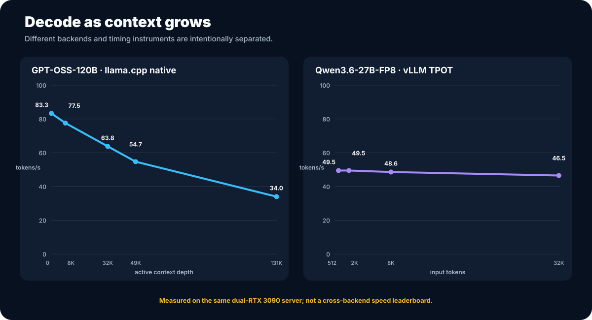
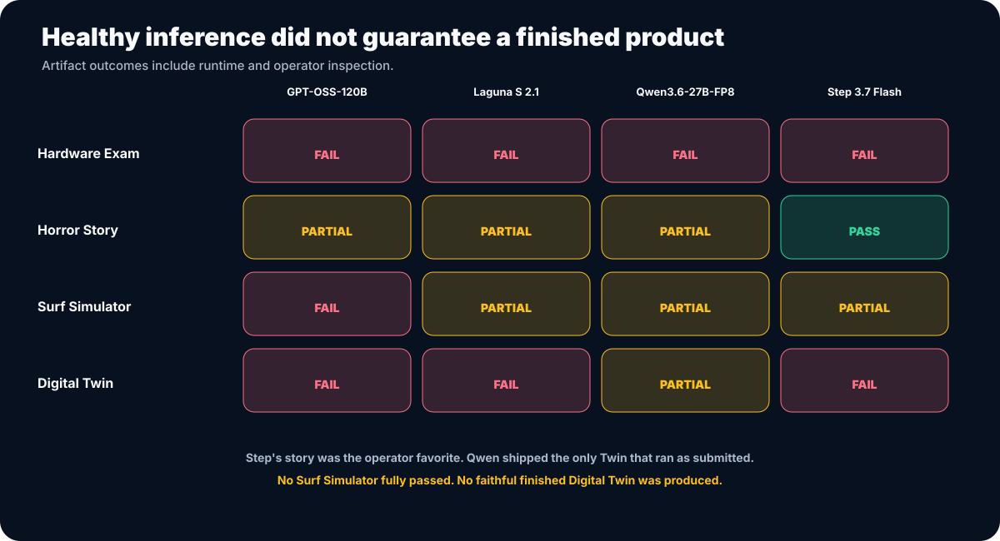

# Local LLM Inference Lab

> Four serious open models. Two RTX 3090s. One question: how far can 48 GB of VRAM and 128 GB of system memory really go?

**Go Big or Go Home, Part 3 — The Local Model Gauntlet**

This repository is the publication-safe technical record of a local-model campaign run on a dual-RTX 3090 Threadripper PRO server. It covers raw inference, long-context behavior, speculative decoding, dense and mixture-of-experts placement, vision, and four shared capability tests.

The headline result is not a single winner:

- **GPT-OSS-120B** was the hybrid-performance and long-context anchor: 83.3 tokens/s at empty context and 34.0 tokens/s at the full 131K window.
- **Qwen3.6-27B-FP8** was the practical overachiever: strong serving behavior, vision, the best autonomous completion rate, and a measured 41.49% MTP uplift at concurrency one.
- **Step 3.7 Flash** was the capacity ceiling and the operator's favorite writer: a 113.82 GiB, nearly 197B-parameter MoE at 35.28 tokens/s with MTP and a 90K context.
- **Laguna S 2.1** delivered usable 35–44 tokens/s generation and strong prose, but did not turn its agentic positioning into reliable task completion.

The machine succeeded. The models often did not. That distinction is the central finding.

## What ran

| Model | Deployment | Context demonstrated | Primary result |
|---|---|---:|---|
| GPT-OSS-120B | 59.02 GiB MXFP4 GGUF, llama.cpp, hybrid CPU/GPU | 131K | Fastest hybrid baseline and full-window pass |
| Laguna S 2.1 | 68.35 GiB UD-Q4_K_XL GGUF, llama.cpp, hybrid CPU/GPU | 100K | Usable raw speed; unreliable autonomous completion |
| Qwen3.6-27B-FP8 | Official block-FP8 weights, vLLM TP=2, fully GPU-resident | 131K server limit; 100K showcase | Best practical agent relative to size and runtime |
| Step 3.7 Flash | 113.82 GiB UD-Q4_K_XL GGUF, llama.cpp, heavy host offload | 90K | Largest model tested; best operator-reviewed prose |

Test machine: AMD Ryzen Threadripper PRO 9955WX, 128 GB eight-channel ECC RDIMM at DDR5-6000, two RTX 3090 Founders Edition cards at PCIe Gen4 x16, Ubuntu 24.04, and no NVLink bridge.

## Results at a glance

### Raw inference

The chart intentionally separates native llama.cpp measurements from vLLM-derived measurements. Those instruments answer related questions, but they are not interchangeable.

### Shared capability tests

| Test | GPT-OSS | Laguna | Qwen | Step |
|---|---|---|---|---|
| Hardware Exam | Complete; technically unreliable | Complete; technically unreliable | Complete; technically unreliable | Extremely verbose; still unreliable |
| Horror Story | Strong; continuity errors | Strong; over length | Strong; 22 words over | **Operator favorite** |
| Surf Simulator | Failed | Runnable partial; failed gameplay | Strong partial; failed gameplay | Best design; failed gameplay |
| Digital Twin | Failed as submitted | No application | **Only app that ran as submitted**; weak fidelity | Failed as submitted; strongest latent design after diagnostic repair |

No model fully passed the Surf Simulator. No model produced a faithful finished Digital Twin. Post-run diagnostic repairs are reported as diagnostics and never converted into passes.

## The findings that matter

1. **48 GB of VRAM is not the machine's total model capacity.** Eight-channel host memory made 59–114 GiB model artifacts practical when the architecture and backend supported hybrid placement.
2. **Tokens per second did not predict product completion.** Every backend completed healthy requests while models produced incorrect analysis, broken imports, invalid screenshots, incomplete apps, or no app.
3. **Qwen punched far above its weight.** It was the smallest model tested, but the most practical autonomous agent and the only one to ship a Digital Twin that ran as submitted.
4. **Step showed both the promise and cost of scale.** It produced the best story and the most ambitious visual work, yet consumed enormous reasoning budgets and still failed both complex visual deliverables.
5. **MTP materially changed usability.** Qwen gained 41.49% at concurrency one and Step gained 25.5% in matched fixed-work decode.
6. **Visual evidence must be inspected.** Non-empty or different PNG files did not prove the requested state; animation noise and title overlays defeated naive checks.

## Repository map

| Path | Contents |
|---|---|
| [`docs/REPORT.md`](docs/REPORT.md) | Full consolidated technical report |
| [`docs/METHODOLOGY.md`](docs/METHODOLOGY.md) | Test design, controls, comparability, and claim rules |
| [`docs/METRICS.md`](docs/METRICS.md) | Metric definitions and instrument boundaries |
| [`docs/FAILURES.md`](docs/FAILURES.md) | Invalid attempts, failures, and lessons |
| [`docs/DATA-DICTIONARY.md`](docs/DATA-DICTIONARY.md) | Field definitions and status notes for every CSV |
| [`data/`](data/) | Redacted normalized CSV tables |
| [`charts/`](charts/) | Generated SVG figures |
| [`scripts/generate_charts.py`](scripts/generate_charts.py) | Dependency-free chart generator |
| [`scripts/validate_public_release.py`](scripts/validate_public_release.py) | Privacy and data checks |
| [`blog/BLOG-DRAFT.md`](blog/BLOG-DRAFT.md) | WordPress-ready Part 3 narrative |
| [`blog/WORDPRESS-CHARTS.html`](blog/WORDPRESS-CHARTS.html) | Responsive HTML charts |
| [`blog/IMAGE-PLAN.md`](blog/IMAGE-PLAN.md) | Visual placement and screenshot privacy checklist |
| [`blog/PUBLISHING.md`](blog/PUBLISHING.md) | SEO metadata, tags, links, and accessibility checklist |
| [`public-prompts/`](public-prompts/) | Redacted public prompt definitions |
| [`selected-outputs/horror/`](selected-outputs/horror/) | Four selected visible story responses for qualitative review |

## Evidence and privacy boundary

This is a curated public export, not a dump of the operating environment. Raw traces, full telemetry, launch scripts, service bindings, local paths, hostnames, addresses, credentials, management topology, and unredacted workspaces are deliberately excluded.

The normalized tables preserve the measurements needed to audit the published claims. See [`PRIVACY.md`](PRIVACY.md) for the release boundary and the automated checks applied to every commit.

## Important comparability rules

- Do not mix llama.cpp native decode with Qwen showcase client-observed output rate.
- Do not treat concurrent aggregate throughput as batch-one decode.
- Do not treat artifact size as active parameter count.
- Do not treat a diagnostic repair as a scored pass.
- Do not call RTX 3090 FP8 execution native FP8 tensor-core execution; this vLLM stack used Marlin FP8 weight-only kernels on SM86.
- Do not promise a fixed CPU-upgrade gain. Different deployments exposed CPU/fabric, PCIe, or GPU-compute limits.

Qwen's raw vLLM performance rows are retained as measured campaign evidence. The internal campaign review requires a sentinel replication before those rows are described as publication-final benchmark results. Qwen's special-workload results are separately labeled as pilot evidence.

## Go Big or Go Home

- [Part 1 — Build and infrastructure](https://github.com/zacangemi/local-llm-infrastructure-v2)
- [Part 2 — Hardware commissioning](https://github.com/zacangemi/local-llm-infrastructure-v2-commissioning)
- Part 3 — Local model testing: this repository
- [Portfolio](https://zacharycangemi.com/portfolio.html)
- [Blog](https://blog.zacharycangemi.com/)

---

Part of [Project Arrival](https://zacharycangemi.com): a public path from senior data science into AI research engineering.
